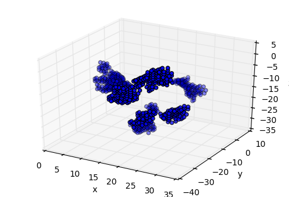
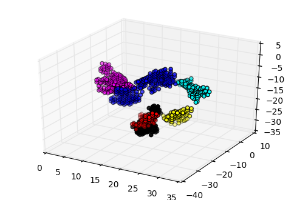

## python模块推荐[04]聚类算法密度算法DBSCAN
### 摘要
根据各种不同的应用场景，发展出了不同的聚类算法，分为：层次，密度，图论，划分，网格和模型这六大类。其中密度聚类DBSCAN（(Density-Based Spatial Clustering of Applications with Noise)是一个典型的基于密度的聚类算法。一句话表述，空间中分布着n个点，如果任意2点距离小于某个阈值，则归为一类。
### 关键概念和参数
- eps 任意2点间的最小距离
- MinPts 最小类的数目
- 在半径eps内含有超过MinPts数目的点，则该点是核心点
- 核心点领域中的点，如果eps内超过MinPts数目的点仍然称为核心店，如果小于MinPts数目，则称为边界点。
- 噪音点，任何不适合核心点或边界点的点

### 代码


```python
#!python2
#coding: utf-8
#导入空间中的点
import numpy as np
pointf=open("points.txt",'r')
point_list=[]
for i in pointf:
   point1=map(float ,i.strip().split())
   #print point1
   point_list.append(point1)
# 在三维空间中显示这些点
%matplotlib inline
%config InlineBackend.close_figures= False
import matplotlib.pyplot as plt
from mpl_toolkits.mplot3d import Axes3D
ax=plt.subplot(111,projection="3d")
x=map(lambda ele:ele[0],point_list)
y=map(lambda ele:ele[1],point_list)
z=map(lambda ele:ele[2],point_list)
ax.scatter(x,y,z)
ax.set_zlabel('z')
ax.set_ylabel('y')
ax.set_xlabel('x')
plt.show()

```





```python
#使用DBscan对上面的点进行聚类
from pyclustering.cluster.dbscan import dbscan
from pprint import pprint
dbscan_instance=dbscan(point_list,1.5,2,False)
dbscan_instance.process()
clusters=dbscan_instance.get_clusters()
print "these points will be cluster to ",len(clusters),"classer"
#print(clusters)
colors=['red','yellow','cyan','black','blue','magenta']
ax2=plt.subplot(111,projection="3d")
for i in clusters:
    points=[     point_list[pointid]        for pointid in i]
    x=map(lambda ele:ele[0],points)
    y=map(lambda ele:ele[1],points)
    z=map(lambda ele:ele[2],points)
    ax2.scatter(x,y,z,c=colors.pop())


plt.show()    
```

    these points will be cluster to  6 classer





** 一共聚成了6类，由于视角的问题，可能红色和黑色有些重叠**，下次会尝试鼠标交互式的图片，给大家带来更好的体验。  
